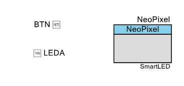
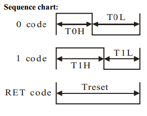

# PSoC_Neopixel
 Lightweight Neopixel Driver

I got into the NeoPixels/WS2812 with this very useful implementation [FunWithLEDS ](https://community.cypress.com/t5/PSoC-Creator-Designer-Software/NeoPixel-WS2811-12-component/td-p/221257)
but the two ICs I wanted to use for the LED Strips PSoC 4000, 4000s where not compatible with this library.
So I had to read quite a bit to figure out a lightweight alternative and also I was intrigued in understanding the protocol. 

I came across [this article](https://wp.josh.com/2014/05/13/ws2812-neopixels-are-not-so-finicky-once-you-get-to-know-them/), it is a really in depth explanation on the communication protocol, and has a easy to follow implementation for Arduino, It only required porting to PSoC and adapting it.



The simplest explanation of this protocol is we have basically three different signals that are communicated from the controller to the Strip.


In this approach I am counting on the time it takes the MCU to shift the output value of a pin.
```c
if (bitVal)
  { // 0 bit
      CY_SYS_PINS_SET_PIN(NeoPixel_pixl__DR, NeoPixel_pixl_SHIFT); 
      CyDelayCycles(2);
      CY_SYS_PINS_CLEAR_PIN(NeoPixel_pixl__DR, NeoPixel_pixl_SHIFT);
      CyDelayCycles(1);
  }
  else
  { // 1 bit
      CY_SYS_PINS_SET_PIN(NeoPixel_pixl__DR, NeoPixel_pixl_SHIFT);            
      CY_SYS_PINS_CLEAR_PIN(NeoPixel_pixl__DR, NeoPixel_pixl_SHIFT);
      CyDelayCycles(1);
  }
```
the program has to send 8bits for each color for each LED then send a reset signal continuously.


the block has four functions (very self explanatory ones)
Send Bit(bool)
Send Byte(uint8_t)
Send Pixel(uint8_t r, uint8_t g, uint8_t b)
Show (RESET)


then on the main program I have some examples based on Josh.com's code,
but I have tweaked the code removing all the blocking bits making them more useful for a full application.


The Demo funtions allow the following functionality cool to try.

  * Solid Color
  * rainbow color gradient
  * running LEDS (Theater Chase)
  * Detonate.